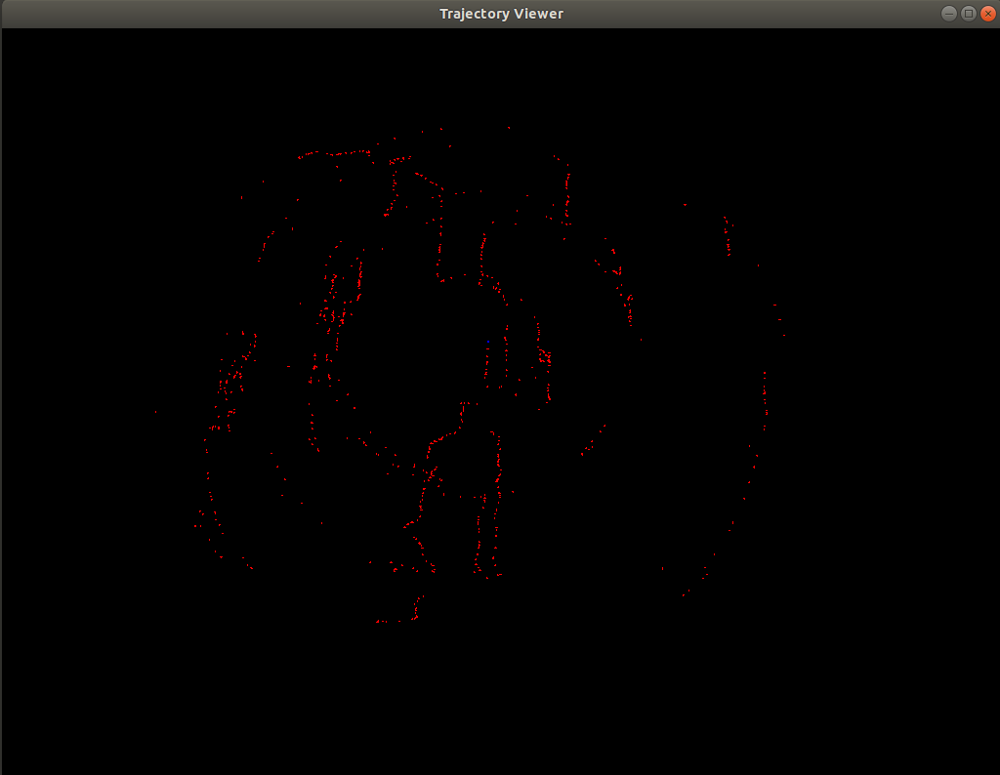

# Stereo_Odometry
***
## Introduction
$\qquad$ this program complete a Stereo Vision odometry  composed of Sparse feature based frontend and a Keyframe based sliding window backend,reference the ORB_SLAM2, PTAM and Visual SLAM 14 lectures
***
## Reference paper
ORB-SLAM2: an Open-Source SLAM System for
Monocular, Stereo and RGB-D Cameras

ORB-SLAM: a Versatile and Accurate
Monocular SLAM System

Parallel Tracking and Mapping for Small AR Workspaces

Improving the Agility of Keyframe-Based SLAM
***
## Dependency
* Eigen used for matrix calculate
* OpenCV used for feature extract and Optical flow tracking of feature points
* G2O used for nonlinear optimization in frontend and backend
* Sophus
* Glog used for log record
* Gflag used to define a global config param
* CSparse
* Gtest
***
## Dataset

$\qquad$ program use Kitti gray img 00/01 dataset to test, change the dataset_dir in config/default.yaml file to your local dataset path. Befor compile the program, change the config_file in app/run_kitti_example.cpp to you local config yaml file path

***
## Build program

$\qquad$ In project dir, execute following steps:

$\qquad$ mkdir build && cd build

$\qquad$ cmake ../

$\qquad$ make

$\qquad$ cd bin && ./run_kitti_example

a traj_result.txt file will generate after program run finished, use the plot_traj in bin dir to plot the traj
***
## Test result

the following img may not show, the traj result is store in traj_result directory

